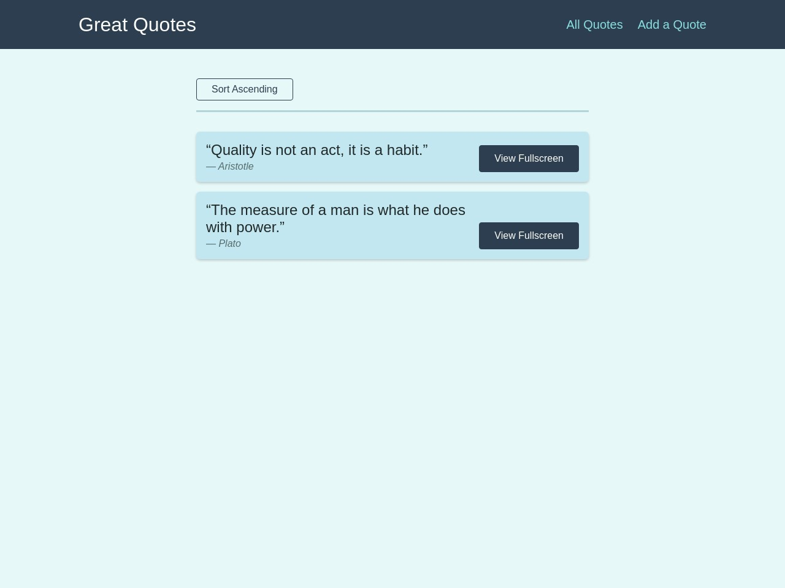

# GREAT QUOTES




## Demo

[View Demo](https://reactquotesappg.web.app/quotes)

## About The Project

Great Quotes is a single-page application built using
React JS and uses firebase as a dummy backend to send/receive
Quotes. This app uses modern React Hooks such as
useReducer, useCallback, useEffect, useRef ..etc
. This application was
built using React Router. The user can add quotes, view them
as well as comment on Quotes.

## Built Using

Great Quotes is built with React JS along with HTML and CSS.
It uses React Router for routing , NPM as package manager and firebase
as dummy backened

- React Hooks (useReducer,useCallback,useEffect..etc)
- HTML
- CSS
- NPM
- React Router

## Getting Started

To get started with project just simply fork this repo or download locally on your System.

To get a local copy up and running follow these simple example steps.

Prerequisites
Start with the latest version of NPM to avoid any errors:

## Prerequisites

Start with the latest version of NPM to avoid any errors:

```bash
  npm install npm@latest -g
```

## Installation

1). Get a firebase account, set up the project & and get the project URL.

2). Open api.js and replace the FIREBASE_DOMAIN link with
the link from firebase

3). On firebase console go to hosting and follow the neccessary steps by running
commands in the terminal.

4). After successfully executing the firebase commands use the obtained link to access the app

## Available Scripts

In the project directory, you can run:

```bash
 npm start
```

Runs the app in the development mode.
Open http://localhost:3000 to view it in your browser.

```bash
npm run build
```

Builds the app for production to the build folder.
It correctly bundles React in production mode and optimizes the build for the best performance.

The build is minified uses only necessary files, the filenames include the hashes.
Your app is ready to be deployed!

## Usage

- Great Quotes allows users to browse Quotes
- Users can add their own Quotes and send them to the firebase backend
- Users can view and add comments in each individual Quotes.
